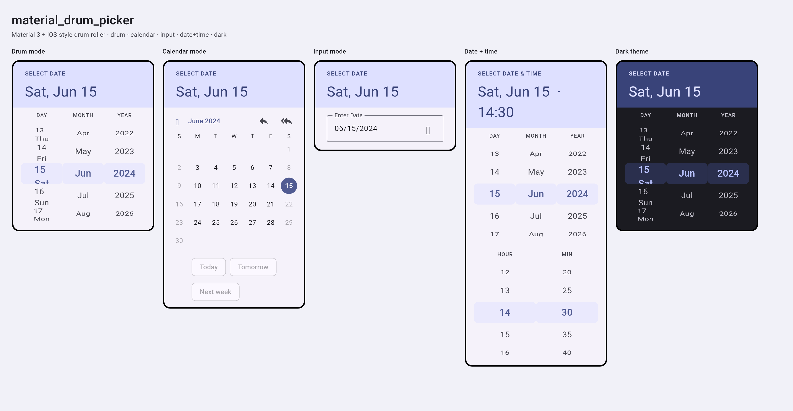

# material_drum_picker

[](https://pub.dev/packages/material_drum_picker)
[](LICENSE)

A Material Design 3 date picker with an iOS-style drum roller, full API parity
with Flutter's `showDatePicker` and `CupertinoDatePicker`, M3 Expressive tokens,
and three context-aware input modes.

---

## Showcase

All the looks rendered straight from the package — drum (with day-of-week),
calendar (quick-selects + disabled weekends), input, date + time, and dark
theme:



> Run the live demo for every option: `cd example && flutter run`, then open the
> **Showcase** screen.

---

## Features

- **Drum mode** — iOS-style scroll wheel. Ideal for birth dates and expiry dates.
- **Calendar mode** — M3 calendar grid with year navigation and configurable
  quick-select chips.
- **Input mode** — keyboard text field with live `MM/DD/YYYY` validation.
- **Date + time** — opt in with `pickTime: true` (or `showDrumDateTimePicker`)
  to add an hour/minute (+ AM/PM) drum strip, with `use24hFormat` and
  `minuteInterval`.
- **Full API parity** with `showDatePicker` + `CupertinoDatePicker` — every
  shared parameter keeps the same name for a friction-free migration.
- **`selectableDayPredicate`** — disable weekends, holidays, or any custom rule,
  enforced in **all three** modes.
- **`quickSelectOptions`** — custom chips (Today, Next Monday, +3 Days, …).
- **`columnOrder`** — Day–Month–Year, Month–Day–Year, or Year–Month–Day.
- **`showDayOfWeekInDrum`** — show the abbreviated weekday in the drum day column.
- **Full M3 theming** — uses `ColorScheme` tokens; no hardcoded colors. Override
  per-app via the `DrumPickerTheme` extension.
- **RTL support** — Arabic, Hebrew, Persian. Weekday and column order auto-flip.
- **Zero runtime dependencies** beyond Flutter and `intl`.
- **All 6 platforms** — Android, iOS, Web, macOS, Windows, Linux.
- **Accessibility** — 44dp touch targets, keyboard navigation in the calendar,
  screen-reader semantics, and reduced-motion compliance.

---

## Installation

```yaml
dependencies:
  material_drum_picker: ^1.0.0
```

Add `flutter_localizations` to your app if you haven't already:

```yaml
dependencies:
  flutter_localizations:
    sdk: flutter
```

And register the delegates in your `MaterialApp`:

```dart
MaterialApp(
  localizationsDelegates: GlobalMaterialLocalizations.delegates,
  supportedLocales: const [Locale('en'), /* your locales */],
)
```

---

## Quick Start

### Drop-in replacement for `showDatePicker`

```dart
import 'package:material_drum_picker/material_drum_picker.dart';

final DateTime? picked = await showDrumDatePicker(
  context: context,
  firstDate: DateTime(1900),
  lastDate: DateTime(2100),
);
```

### Birth date picker

```dart
final today = DateTime.now();
final birthDate = await showDrumDatePicker(
  context: context,
  initialMode: DrumPickerMode.drum,        // drum wheel for distant dates
  firstDate: DateTime(today.year - 120),
  lastDate: DateTime(today.year - 18, today.month, today.day),
  columnOrder: DrumColumnOrder.dmy,        // Day–Month–Year
  showModeToggle: false,                   // lock to drum mode
  helpText: 'SELECT BIRTH DATE',
);
```

### Appointment picker — no weekends

```dart
final appointment = await showDrumDatePicker(
  context: context,
  initialMode: DrumPickerMode.calendar,
  firstDate: DateTime.now(),
  lastDate: DateTime.now().add(const Duration(days: 90)),
  selectableDayPredicate: (day) =>
      day.weekday != DateTime.saturday && day.weekday != DateTime.sunday,
  confirmText: 'BOOK APPOINTMENT',
);
```

### Inline widget — embedded in a form

```dart
DrumPicker(
  firstDate: DateTime.now(),
  lastDate: DateTime(2040),
  initialMode: DrumPickerMode.drum,
  showActions: false,        // no Cancel/OK — use your own form submit
  showModeToggle: false,
  onChanged: (date) => setState(() => _expiryDate = date),
)
```

### Custom quick selects

```dart
showDrumDatePicker(
  context: context,
  firstDate: DateTime.now().add(const Duration(days: 1)),
  lastDate: DateTime.now().add(const Duration(days: 30)),
  quickSelectOptions: [
    DrumQuickSelect.relative(label: 'Express +1',  offset: const Duration(days: 1)),
    DrumQuickSelect.relative(label: 'Standard +3', offset: const Duration(days: 3)),
    DrumQuickSelect.relative(label: 'Economy +7',  offset: const Duration(days: 7)),
  ],
);
```

### Date + time

```dart
final when = await showDrumDateTimePicker(
  context: context,
  firstDate: DateTime(2020),
  lastDate: DateTime(2030),
  use24hFormat: true,   // null → follows MediaQuery.alwaysUse24HourFormat
  minuteInterval: 15,   // 0, 15, 30, 45
);
// `when` is a DateTime carrying the chosen hour and minute.
```

Or inline, embedded in a form:

```dart
DrumPicker(
  firstDate: DateTime(2020),
  lastDate: DateTime(2030),
  pickTime: true,
  minuteInterval: 5,
  showActions: false,
  onChanged: (dateTime) => setState(() => _value = dateTime),
)
```

---

## API Reference

### `showDrumDatePicker`

| Parameter | Type | Default | Description |
|---|---|---|---|
| `context` | `BuildContext` | required | Build context |
| `firstDate` | `DateTime` | required | Minimum selectable date |
| `lastDate` | `DateTime` | required | Maximum selectable date |
| `initialDate` | `DateTime?` | today | Pre-selected date |
| `currentDate` | `DateTime?` | `DateTime.now()` | The "today" marker |
| `selectableDayPredicate` | `SelectableDayPredicate?` | null | Return false to disable a day |
| `initialMode` | `DrumPickerMode` | `.drum` | Starting input mode |
| `showModeToggle` | `bool` | `true` | Show mode tabs |
| `columnOrder` | `DrumColumnOrder?` | locale default | Column order in drum mode |
| `showDayOfWeekInDrum` | `bool` | `false` | Show weekday in drum day column |
| `showQuickSelects` | `bool` | `true` | Show quick-select chips |
| `quickSelectOptions` | `List<DrumQuickSelect>?` | Today/Tomorrow/+7d | Custom chips |
| `pickTime` | `bool` | `false` | Also pick a time of day |
| `use24hFormat` | `bool?` | ambient | 24-hour time strip (no AM/PM) |
| `minuteInterval` | `int` | `1` | Minute granularity (divisor of 60) |
| `helpText` | `String?` | `'SELECT DATE'` | Header label |
| `confirmText` | `String?` | `'OK'` | Confirm button text |
| `cancelText` | `String?` | `'Cancel'` | Cancel button text |
| `errorFormatText` | `String?` | `'Invalid format…'` | Input mode format error |
| `errorInvalidText` | `String?` | `'Out of range'` | Input mode range error |
| `fieldHintText` | `String?` | `'MM/DD/YYYY'` | Input field hint |
| `fieldLabelText` | `String?` | `'Enter Date'` | Input field label |
| `locale` | `Locale?` | ambient | Locale override |
| `textDirection` | `TextDirection?` | ambient | Text direction override |
| `barrierDismissible` | `bool` | `true` | Tap outside to dismiss |
| `barrierColor` | `Color?` | `Colors.black54` | Barrier color |
| `barrierLabel` | `String?` | localized | Barrier accessibility label |
| `useRootNavigator` | `bool` | `true` | Use root navigator |
| `routeSettings` | `RouteSettings?` | null | Route settings |
| `restorationId` | `String?` | null | State restoration ID |
| `anchorPoint` | `Offset?` | null | Split-screen anchor |
| `builder` | `TransitionBuilder?` | null | Wrap dialog with `Theme`, etc. |

### `DrumPicker` widget

All parameters from `showDrumDatePicker` are available on the inline widget,
plus:

| Parameter | Type | Default | Description |
|---|---|---|---|
| `showActions` | `bool` | `true` | Show Cancel/OK buttons |
| `onChanged` | `ValueChanged<DateTime>?` | null | Called on every selection change |
| `onConfirmed` | `ValueChanged<DateTime>?` | null | Called when OK is tapped |
| `onCancelled` | `VoidCallback?` | null | Called when Cancel is tapped |
| `onModeChanged` | `ValueChanged<DrumPickerMode>?` | null | Called on mode switch |

### `DrumColumnOrder`

| Value | Format | Typical regions |
|---|---|---|
| `dmy` | 15 Jun 2024 | UK, Europe, MENA, Australia |
| `mdy` | Jun 15 2024 | United States, Canada |
| `ymd` | 2024 Jun 15 | Japan, China, Korea |
| `ydm` | 2024 15 Jun | Rarely used |

### `DrumPickerMode`

| Value | Best for |
|---|---|
| `drum` | Birth dates, expiry dates, distant past/future |
| `calendar` | Scheduling events, appointments, near-future |
| `input` | Power users, accessibility tools, typed entry |

### `DrumPickerTheme`

Add to `ThemeData.extensions` to override individual tokens:

```dart
ThemeData(
  useMaterial3: true,
  extensions: const [
    DrumPickerTheme(
      headerBackgroundColor: Color(0xFF004D40),
      headerTextColor: Colors.white,
      itemExtent: 48,
      visibleItemCount: 3,
    ),
  ],
)
```

---

## Migration from `showDatePicker`

Most parameters have identical names — usually only the function name changes:

```dart
// Before
showDatePicker(
  context: context,
  initialDate: myDate,
  firstDate: DateTime(1900),
  lastDate: DateTime(2100),
  selectableDayPredicate: myPredicate,
  helpText: 'PICK DATE',
  locale: myLocale,
);

// After — identical parameter names
showDrumDatePicker(
  context: context,
  initialDate: myDate,
  firstDate: DateTime(1900),
  lastDate: DateTime(2100),
  selectableDayPredicate: myPredicate,
  helpText: 'PICK DATE',
  locale: myLocale,
  initialMode: DrumPickerMode.calendar, // optional: same feel as showDatePicker
);
```

---

## Roadmap

- **v1.0** — Single date picker (drum + calendar + input modes).
- **v1.1** — Combined date + time picking (`pickTime`, `showDrumDateTimePicker`).
- **next** — `showDrumDateRangePicker` (date range selection).

---

## License

MIT © 2026 — see [LICENSE](LICENSE).
